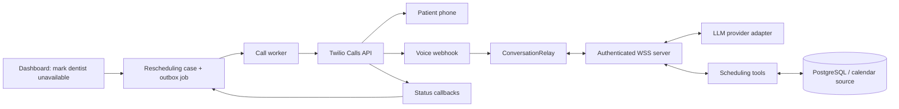
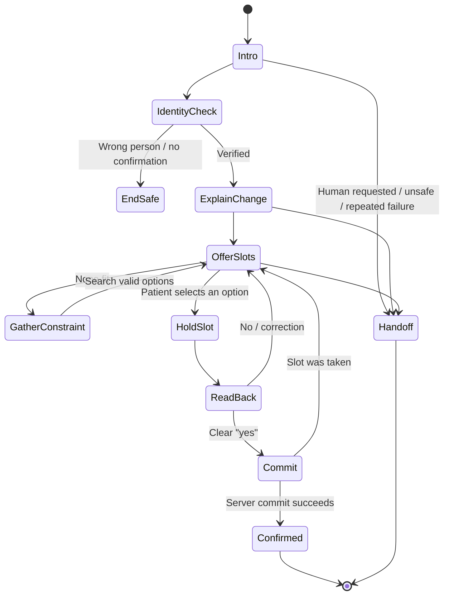

# ConversationRelay Appointment-Rescheduling MVP Research

**Scope:** outbound calls when a dentist becomes unavailable and patients need a new appointment.

**Research date:** 14 August 2026.

**Recommendation:** Build a controlled, text-based voice workflow. Use Twilio ConversationRelay for phone, speech-to-text, and text-to-speech. Use an LLM only to manage dialogue. Keep appointment selection and booking in server-side tools.

OpenAI describes this as a chained voice pipeline. It is a good fit for predictable and approval-heavy workflows because the application controls each text and booking step. [OpenAI voice-agent guidance](https://developers.openai.com/api/docs/guides/voice-agents)

> **Important correction for the demo:** Current Twilio trial documentation lists `<ConversationRelay>` as a blocked TwiML noun. A free trial cannot run this exact architecture. Upgrade the Twilio project before testing ConversationRelay. Twilio's post-upgrade free-unit table lists 30 ConversationRelay minutes, but confirm the balance in the Console. [Twilio trial restrictions](https://www.twilio.com/docs/usage/trials/try-out-voice) and [trial account details](https://www.twilio.com/docs/usage/trials)

## 1. Recommended MVP architecture



### Component boundaries

| Component | Owns | Must not own |
|---|---|---|
| Dashboard | Dentist-unavailable action, review queue, manual follow-up | Live call logic |
| Transaction service | Creates one rescheduling case per affected appointment | Calling Twilio inside the database transaction |
| Outbox and call worker | Queues and starts calls, retry policy, rate limits | Scheduling decisions |
| Twilio | PSTN connection, STT, TTS, call progress, ConversationRelay transport | Patient data authority or appointment updates |
| Voice webhook | Fast TwiML response and call-to-case lookup | Slow LLM work |
| WebSocket service | A call session, dialogue state, token streaming, tool loop | Long-term business truth |
| Scheduling service | Slots, holds, conflict checks, final booking transaction | Natural-language interpretation |
| LLM | Understands speech text, asks clear questions, selects safe tools | Inventing slots, writing appointments, deciding clinical matters |
| Database | Cases, appointments, holds, contact attempts, audit trail | In-memory call connection state |

This boundary is the central design rule: **a prompt is not an authorization system**. The LLM can request a tool. Only the server can complete a booking.

### Why ConversationRelay fits this use case

ConversationRelay gives the application a WebSocket. It sends transcribed speech as structured messages. The application sends text back, which ConversationRelay speaks. It handles live STT, TTS, session handling, and low-latency delivery. [ConversationRelay reference](https://www.twilio.com/docs/voice/twiml/connect/conversationrelay)

This makes it easier to:

- Keep a durable transcript and state machine.
- Use an LLM from any provider through one server-side adapter.
- Validate calendar tools before every change.
- Stop or hand off a conversation without an audio-streaming stack.

Do not use Twilio Media Streams for this MVP. Media Streams sends raw audio. It requires a separate STT and TTS pipeline.

## 2. Repository impact

The current repository is a Next.js and React user interface. It has no database, job worker, Twilio integration, or WebSocket service.

Add these as server-side capabilities. Do not put Twilio credentials or LLM credentials in browser code.

Suggested logical modules are:

| Module | Purpose |
|---|---|
| `rescheduling` | Cases, policy, appointment state machine |
| `scheduler` | Valid slots, holds, atomic commit |
| `calls` | Outbox worker, Twilio Calls API, status callbacks |
| `voice` | TwiML endpoint, WebSocket session, conversation state |
| `llm` | Provider-neutral streaming and tool calling adapter |
| `audit` | Redacted events, metrics, review queue |

Useful Node packages are `twilio`, a WebSocket server such as `ws` or Fastify WebSocket support, `zod`, PostgreSQL tooling, a durable queue, and structured logging. Do not install them until the implementation plan is accepted.

## 3. Outbound call and ConversationRelay lifecycle

### 3.1 Create the rescheduling case first

When a dentist marks a date unavailable:

1. Create a `rescheduling_case` for every affected appointment.
2. Mark the old appointment as `displaced`, not silently deleted.
3. Save the required duration, dentist, room or equipment rules, location, timezone, and allowed scheduling window.
4. Write an outbox event in the same database transaction.
5. Let a worker create the call after the transaction commits.

The outbox avoids a case that exists without a call, or a call that starts before its case exists.

### 3.2 Create the outbound call

The worker calls Twilio's Calls API with:

- A Twilio `from` number.
- The patient's E.164 `to` number.
- A `url` for the voice webhook.
- A `statusCallback` URL with `initiated`, `ringing`, `answered`, and `completed` events.
- A short ring timeout.
- An opaque, single-use case token in the voice-webhook URL or internal lookup table.

Twilio starts outbound calls with `POST` to the Calls resource. Calls above the account Calls-Per-Second limit queue, so a bulk rescheduling event needs a paced worker. [Calls resource](https://www.twilio.com/docs/voice/api/call-resource)

Use status callbacks as facts about a call attempt. They can report `initiated`, `ringing`, `answered`, and completion states such as `busy`, `failed`, and `no-answer`. [Voice callback events](https://www.twilio.com/docs/usage/webhooks/voice-webhooks)

### 3.3 Serve TwiML quickly

When a call is answered, Twilio requests the voice webhook. The endpoint must:

1. Validate the Twilio request signature.
2. Resolve the active case from the opaque token and `CallSid`.
3. Return TwiML immediately.

Use a `<Connect action="...">` wrapper around `<ConversationRelay>`. The `action` URL runs when the relay ends. It can transfer to staff or end the call. [ConversationRelay `action` callback](https://www.twilio.com/docs/voice/twiml/connect/conversationrelay)

Conceptual TwiML:

```xml
<Response>
  <Connect action="https://api.example.com/voice/relay-complete">
    <ConversationRelay
      url="wss://voice.example.com/conversation"
      welcomeGreeting="Hello. This is the scheduling assistant from Demo Dental Clinic."
      speechTimeout="1200"
      interruptSensitivity="medium"
      reportInputDuringAgentSpeech="none">
      <Parameter name="caseToken" value="opaque-one-time-token" />
    </ConversationRelay>
  </Connect>
</Response>
```

The initial greeting must not disclose an appointment, dentist, or health detail. A wrong person can answer the phone.

`<Parameter>` values appear in the WebSocket `setup` message. Put only an opaque token there. Do not put patient names, phone numbers, diagnosis, or appointment details in TwiML, URLs, or custom parameters. [Custom parameter behaviour](https://www.twilio.com/docs/voice/twiml/connect/conversationrelay)

### 3.4 Validate the WebSocket and link the session

ConversationRelay requires a public `wss://` server. It sends an `X-Twilio-Signature` header in the opening handshake. Validate it with Twilio's server SDK before accepting the socket. [ConversationRelay onboarding](https://www.twilio.com/docs/voice/conversationrelay/onboarding)

On the first `setup` message:

1. Verify the `CallSid` is the expected active attempt.
2. Verify the opaque case token is active and has not expired.
3. Create `voice_session` state keyed by `CallSid` and `sessionId`.
4. Load only the minimal rescheduling context.
5. Record the session start time and chosen language.

### 3.5 Handle each live message

| Twilio message | Meaning | MVP handling |
|---|---|---|
| `setup` | Socket opened; includes call and custom data | Validate and load state |
| `prompt` with `last: false` | Partial speech | Do not ask the LLM yet. Buffer only if you need diagnostics. |
| `prompt` with `last: true` | A completed patient turn | Run intent and tool loop |
| `dtmf` | A pressed key, when enabled | Use only for a small fixed menu |
| `interrupt` | Patient spoke over agent TTS | Cancel stale generation and wait for the final prompt |
| `error` | Relay or message error | Log, give a safe fallback, then hand off or end |

Twilio defines these message types and the final-turn marker. [ConversationRelay WebSocket messages](https://www.twilio.com/docs/voice/conversationrelay/websocket-messages)

### 3.6 Return speech safely

Stream completed text chunks to Twilio as `text` messages. Preserve spaces between chunks. Mark only the final chunk with `last: true`.

Twilio recommends streaming tokens as they arrive to reduce first-audio latency. It also warns against trimming token spacing. [ConversationRelay best practices](https://www.twilio.com/docs/voice/conversationrelay/best-practices)

For this product, do not emit raw LLM tokens one-by-one. Buffer until a short clause or sentence boundary, then send it. This gives natural speech without waiting for the full answer.

## 4. Turn-taking and interruption settings

Start with deliberate settings. Tune them through real phone tests.

| Setting | MVP starting choice | Reason |
|---|---|---|
| `speechTimeout` | `1200` ms | A reasonable first pause. Test from 900–1500 ms. Twilio permits 600–5000 ms. |
| `interruptSensitivity` | `medium` | Reduces false barge-ins while still allowing an interruption. |
| `interruptible` | `speech` for normal replies | The caller can stop long replies without random DTMF effects. |
| `reportInputDuringAgentSpeech` | `none` | Avoid processing talk-over input twice. Set it explicitly because its default changed. |
| `partialPrompts` | `false` | Process only completed speech turns in the MVP. |
| `dtmfDetection` | `false` initially | Turn it on only for a specific fixed action. |
| `ignoreBackchannel` | `false` during confirmations | Short words such as “yes” can be material. Test before filtering backchannels. |
| `events` | `speaker-events tokens-played` in production | Supports latency and playback observability. |

These controls, their valid values, and their provider limits are documented in the [ConversationRelay TwiML reference](https://www.twilio.com/docs/voice/twiml/connect/conversationrelay).

### Interruption algorithm

When an `interrupt` arrives:

1. Increment a per-call `generationId`.
2. Abort the current LLM stream.
3. Stop sending remaining text chunks for the old generation.
4. Do not treat `utteranceUntilInterrupt` as the patient's final intent.
5. Wait for the next final `prompt` message.
6. Rebuild the next LLM input from the stored, completed turns and current scheduler state.

This prevents an old answer from speaking after the patient has changed direction.

Tool calls need the same protection. An interrupted offer can create a temporary hold. It must not confirm a booking. Only an explicit later confirmation can commit it.

### Voice wording rules

Normalize text before it reaches TTS:

- Say “Tuesday, the twelfth of August, at four thirty p.m.”
- Do not say `12/08` or `4:30` without its date and time zone.
- Say “Doctor” instead of “Dr.” when a voice misreads it.
- Convert symbols and abbreviations to spoken words.
- Keep patient and doctor name formatting consistent.

Twilio specifically recommends spelling out dates, numbers, abbreviations, and special characters for clear TTS. [Text-normalization guidance](https://www.twilio.com/docs/voice/conversationrelay/best-practices)

## 5. Conversation design

### Production conversation path



### Recommended dialogue rules

1. State that the caller is an automated scheduling assistant.
2. Ask if now is a good time.
3. Confirm the person before disclosing appointment facts.
4. Give a brief, neutral reason: “There is a scheduling change.”
5. Offer two or three valid options at a time.
6. Ask one question at a time.
7. Repeat the selected date, time, location, and clinician before commit.
8. Require a clear affirmative confirmation.
9. Say “confirmed” only after the server tool returns success.
10. Offer staff handoff at every failure boundary.

Never explain the dentist's personal reason. Never provide medical advice. Never discuss diagnosis, treatment, insurance, or a full patient history.

### System prompt structure

Keep the system prompt compact and policy-focused. Do not paste uncontrolled clinical data into it.

```text
You are the outbound scheduling assistant for Demo Dental Clinic.

Your only job is to reschedule the active appointment case.
State that you are an automated assistant.
Do not disclose appointment information before contact verification.
Use only appointment facts returned by tools.
Never invent availability, confirm a slot without a tool result, or give clinical advice.
Offer at most three slots at a time.
Ask for a clear yes before calling commit_reschedule.
If input is unclear twice, a person asks for staff, or a tool fails, request_handoff.
Use short spoken sentences. Read dates and times in full.
```

Use the static prompt once. Add short current facts for each completed turn. OpenAI's current model guidance advises lean prompts and precise tool descriptions. [Official OpenAI model guidance](https://developers.openai.com/api/docs/guides/latest-model)

## 6. Required context, and context to avoid

### Context to build on `setup`

| Field | Why it is needed | Send to LLM? |
|---|---|---|
| Clinic display name and staffed handoff number | Safe introduction and escalation | Yes |
| Case ID and call ID | Server correlation | No; keep server-side |
| Contact preferred name | Natural greeting after verification | Yes, only if policy permits |
| Preferred language and timezone | Correct STT/TTS and date speech | Yes |
| Affected appointment date and duration | Explain and find equivalent appointment | Yes, after verification |
| Dentist and location rules | Prevent wrong provider or location | Yes, if necessary |
| Slot search policy | Limits, business hours, approved date range | Yes |
| Contact preference and attempt count | Respect quiet hours and opt-out | Yes, as a rule or boolean |
| Current hold and expiry | Avoid re-offering stale slots | Yes |
| Current turn summary | Conversation continuity | Yes |

### Do not send by default

- Entire medical history.
- Diagnosis, treatment notes, prescriptions, images, insurance data, or full date of birth.
- Full phone number or other unrelated contact data.
- Internal database IDs, access tokens, raw calendar records, or full clinician schedules.
- A long transcript when a short state summary will do.

For rescheduling, medical history is normally irrelevant. Use the minimum data that can solve the scheduling task. This also lowers model cost and reduces privacy exposure.

If using OpenAI Responses, response objects are stored for 30 days by default. `store: false` disables that default response storage. Use an explicit retention decision and check the selected provider's terms before sending real patient data. [OpenAI conversation-state guidance](https://developers.openai.com/api/docs/guides/conversation-state)

### Per-turn context builder

For each final `prompt`, build:

1. Static system policy.
2. A small case summary.
3. Current controlled state: verified, selected slot, hold state, attempt number.
4. A short summary of earlier completed turns.
5. The current final transcript.
6. Only the active scheduling tools.

The database is the durable state. Do not trust an LLM conversation thread as the source of truth.

## 7. Tool contract and scheduling safety

### Small, safe tool set

| Tool | Inputs allowed from LLM | Server checks | Result |
|---|---|---|---|
| `get_case_context` | None | Session maps to active case | Safe current facts |
| `verify_contact` | Confirmation only | Policy and attempt count | Verified or safe end |
| `search_slots` | Natural-language constraints | Case duration, dentist, room, timezone, availability | Two or three valid slots |
| `hold_slot` | A slot ID returned by `search_slots` | Slot still available; case active | Hold ID and expiry |
| `commit_reschedule` | Hold ID and explicit confirmation | Hold owner, expiry, no conflict, case version | Confirmed appointment |
| `record_contact_preference` | Opt-out or preferred window | Validate and persist | Acknowledgement |
| `request_handoff` | Reason code | Queue or callback policy | Handoff result |
| `end_call` | Reason code | Log only | Safe termination |

Resolve the appointment case from the server session. Do not let the model pass arbitrary `patientId`, `appointmentId`, or an unrestricted start time.

Use strict function schemas. OpenAI recommends strict mode; it requires closed object schemas and required properties. Disable parallel tool calls for this scheduling flow so two state-changing tools cannot race. [OpenAI function-calling guidance](https://developers.openai.com/api/docs/guides/function-calling)

### Prevent slot conflicts

Use all of these controls:

1. **Search:** Return only slots matching duration, dentist, room, equipment, location, timezone, calendar state, and clinic policy.
2. **Hold:** Create a short hold, such as two minutes, scoped to one case and one slot.
3. **Commit:** In one database transaction, check that the case is active, the hold belongs to it, the hold has not expired, and the slot still has no overlap.
4. **Constraint:** Enforce the non-overlap rule in the database or calendar provider, not only in application code.
5. **Version check:** Include the appointment or calendar revision that was used to search.
6. **Retry outcome:** If a commit conflicts, remove the hold, search again, and explain that the option was just taken.
7. **Idempotency key:** Make `commit_reschedule` idempotent by case and hold. A duplicate webhook or retry must return the first successful result.

For PostgreSQL, model time as timezone-aware ranges and enforce an exclusion constraint or equivalent transaction lock. For an external calendar, use its conditional-write or version mechanism in addition to your local lock.

### Appointment state model

| State | Meaning | Allowed next state |
|---|---|---|
| `pending` | Case exists; no call started | `dialing`, `staff_review`, `cancelled` |
| `dialing` | Worker requested a call | `in_call`, `retry_scheduled`, `unreachable` |
| `in_call` | Valid ConversationRelay session | `hold_active`, `staff_review`, `retry_scheduled` |
| `hold_active` | Patient selected a temporary slot | `in_call`, `rescheduled`, `staff_review` |
| `rescheduled` | New slot committed and old appointment released | Final |
| `retry_scheduled` | Safe retry time exists | `dialing`, `staff_review` |
| `unreachable` | Attempts exhausted | `staff_review` |
| `staff_review` | Human action is required | `rescheduled`, `cancelled` |
| `cancelled` | Case was resolved outside this call | Final |

Never erase the original appointment. Preserve its relationship to the replacement appointment and the reason for displacement.

## 8. Edge-case playbook

| Situation | Required behaviour |
|---|---|
| Wrong person answers | Do not reveal any appointment fact. Ask for the patient or end safely. |
| Patient is busy | Offer a generic callback window. Do not leave detail in a voicemail. |
| No answer, busy, failed | Update attempt from status callback. Retry only within approved business hours and below a fixed attempt cap. |
| Voicemail detected | Treat as a safe notification path. Leave only a generic callback request if the policy allows it. |
| Answering-machine detection is wrong | Treat AMD as a hint, not proof. It can misclassify humans and short greetings. [AMD guidance](https://www.twilio.com/docs/voice/answering-machine-detection) |
| Caller asks “who is this?” | State clinic name, automated scheduling role, and staff callback option. |
| Caller cannot verify identity | Do not disclose the appointment. Offer staff contact. |
| Caller says “not me” | Mark possible wrong number. Stop retries pending staff review. |
| Caller wants a human | Call `request_handoff` immediately. Do not argue or continue sales-style dialogue. |
| Caller asks a clinical question | State that you cannot help with medical questions. Hand off. |
| Caller says “do not call” | Persist the preference immediately. Confirm once and end. |
| Silence after a question | Repeat once in simpler words. Then offer a callback or staff route. |
| Poor transcript or noise | Ask the caller to repeat one specific fact. Do not guess a date or time. |
| Ambiguous date: “next Friday” | Resolve with timezone and read the full calendar date back. Require confirmation. |
| Patient proposes a time | Convert it into a constraint and run `search_slots`. Never book the spoken time directly. |
| Patient says no to selected slot | Release or let the hold expire. Search again. |
| Slot becomes unavailable at commit | Do not say it is confirmed. Explain briefly and offer fresh options. |
| LLM timeout or provider error | Play one concise failure message, then hand off or schedule retry. Do not keep the call silent. |
| WebSocket disconnect | Persist state. Do not expect automatic relay reconnection. Use the `<Connect action>` route to decide whether a fresh relay session is safe. [Relay failure behaviour](https://www.twilio.com/docs/voice/conversationrelay/websocket-messages) |
| Malformed outbound WebSocket message | Log it. After ten consecutive invalid messages, Twilio terminates the connection. Validate internal message schemas first. [Relay error codes](https://www.twilio.com/docs/voice/conversationrelay/websocket-messages) |
| Duplicate webhook | Deduplicate effects by event identity or Twilio idempotency token. Never create another case or booking. [Twilio webhook retry controls](https://www.twilio.com/docs/usage/webhooks/webhooks-connection-overrides) |
| Multiple languages | Start with one chosen language. Add one tested language pair at a time. Automatic `multi` STT requires Deepgram, and `multi` TTS requires ElevenLabs. [Language constraints](https://www.twilio.com/docs/voice/twiml/connect/conversationrelay) |
| DTMF presses | Use them only for safe menu choices, such as “press one for staff.” Do not use DTMF as proof of identity. |
| Doctor restores availability | Mark active cases cancelled or paused. Revalidate the case before every hold and commit. |

## 9. Reliability and retries

### Call attempts

Use a business policy, not an uncontrolled retry loop:

- Respect contact preferences and quiet hours.
- Limit attempts per case and per day.
- Separate `no-answer`, `busy`, `wrong-number`, `do-not-call`, and `system-failed` outcomes.
- Set the next attempt only after an idempotent state update.
- Send unresolved cases to a staff review queue.

Twilio can retry failed webhook requests. Voice webhooks have a hard 15-second request limit, so the voice endpoint must return TwiML without model work. Use `I-Twilio-Idempotency-Token` where Twilio supplies it and make handlers idempotent. [Webhook connection overrides](https://www.twilio.com/docs/usage/webhooks/webhooks-connection-overrides)

### Relay failure handling

ConversationRelay does not automatically reconnect if its WebSocket disconnects; the call can end as `failed`. The `action` callback can return a new `<Connect><ConversationRelay>` request, but only do so after checking the `CallSid`, case state, and recent session state. [ConversationRelay reconnect guidance](https://www.twilio.com/docs/voice/conversationrelay/websocket-messages)

For the MVP, a simple safe outcome is better than an invisible reconnect loop:

1. Persist the incomplete turn and session reason.
2. Mark the attempt as `technical_failure`.
3. Create a staff-review item or one future retry.
4. Do not assume a booking did not happen; query the case first.

## 10. Security, privacy, and launch limits

### Required technical controls

- Use HTTPS for HTTP webhooks and `wss://` for ConversationRelay.
- Validate every HTTP webhook signature.
- Validate the lowercase `x-twilio-signature` header during the WebSocket handshake.
- Use Twilio's SDK validator, not a custom reimplementation.
- Reject a socket unless its `CallSid` and opaque case token map to an active call.
- Store keys in server-side environment variables or a secret manager.
- Redact patient data from application logs, error tracking, and LLM traces.
- Set retention periods for transcripts, recordings, and call metadata.
- Keep recording off in the demo. Obtain legal approval and appropriate notice before recording production calls.

Twilio signs inbound webhooks and explicitly recommends using its SDK for validation. A self-signed TLS certificate is not accepted for live webhook connections. [Twilio webhook security](https://www.twilio.com/docs/usage/webhooks/webhooks-security)

### Demo versus production

| Area | Demo | Production |
|---|---|---|
| Data | Fictional patients only | Minimum necessary real data |
| Caller | Your own verified test phone | Approved clinic number and routing |
| Conversations | Test script and staff fallback | Consent, identity, opt-out, local legal approval |
| Recording | Off | Explicit policy, notice, retention, encryption |
| LLM | Any safe test account | Contract, data-processing review, provider controls |
| Deployment | Tunnel allowed briefly | Public TLS, monitored service, secrets, backups |
| Scheduling | Seed data | Atomic calendar and database writes |

For US HIPAA work, ConversationRelay is only eligible when configured correctly, and Twilio says the customer must arrange appropriate compliance for its own application and AI provider. It also prohibits use for clinical decisions or medical advice. [Twilio HIPAA architecture guide](https://www.twilio.com/content/dam/twilio-com/global/en/other/hipaa/pdf/Architecting-for-HIPAA.pdf)

For an India launch, treat outbound automated calls as commercial communications until qualified local counsel and the carrier say otherwise. TRAI explains that voice calls can be unsolicited commercial communication, with consent and registered preference requirements. [TRAI UCC guidance](https://trai.gov.in/what-spam-or-ucc)

This report is technical guidance, not legal advice.

## 11. Observability and review

Log structured, redacted events for each case:

- `caseId`, `CallSid`, `sessionId`, and attempt number.
- Outbound request and status-callback transitions.
- Webhook validation result.
- Time to answer, first final transcript, first LLM token, and first TTS playback.
- Turn count, interruption count, tool name, tool result category, and state transition.
- Handoff, retry, opt-out, wrong-number, and completion reason.
- Relay error code and model provider error class.

Track these metrics:

| Metric | Why it matters |
|---|---|
| Answer rate | Detect bad timing, carrier, or caller-ID reputation |
| Reschedule completion rate | Product outcome |
| Staff-handoff rate | Finds unsupported dialogue branches |
| Slot-conflict rate | Finds calendar race bugs |
| Wrong-number and opt-out rate | Safety and data quality |
| Median first-audio latency | Conversation quality |
| Interrupt rate | Turn-taking tuning |
| STT clarification rate | Speech provider or phrase problems |
| Call failure and 641xx error rate | Relay or infrastructure health |

ConversationRelay can emit speaker and token-played events, and Twilio exposes ConversationRelay events in Voice Insights. [ConversationRelay event reference](https://www.twilio.com/docs/voice/voice-insights/api/call/details-conversation-relay-events)

Review a small sample of redacted test calls before expanding call volume. Inspect every wrong booking, unexpected disclosure, unclear transcript, and staff handoff. Add them to a regression set.

## 12. Local development and deployment

### Local development

Twilio cannot reach `localhost`. Use a public tunnel for both the HTTPS webhook and the `wss://` service. Twilio documents ngrok as a local development option and warns that a tunnel exposes the machine to the internet. [Twilio local webhook testing](https://www.twilio.com/docs/twilio-cli/general-usage/work-with-webhooks)

Use separate local routes:

- `https://<tunnel>/api/voice/twiml`
- `https://<tunnel>/api/voice/status`
- `https://<tunnel>/api/voice/relay-complete`
- `wss://<tunnel>/voice/conversation`

Test signature validation through the tunnel. Reverse proxies can change the URL seen by the app, which can break signature validation. Preserve the original public URL.

### Deployment choice

The web UI and ordinary HTTP webhooks can run together. The WebSocket service needs more care.

Current Vercel documentation says Functions can serve WebSockets, but a connection is pinned to a function instance and may close at the duration limit or when an instance recycles. Shared session state must live in an external store, and clients must reconnect. [Vercel WebSocket guidance](https://vercel.com/kb/guide/do-vercel-serverless-functions-support-websocket-connections)

That can work, but ConversationRelay's own disconnection behaviour makes it higher risk for the first production voice path. For this MVP, prefer either:

1. A long-running Node WebSocket service plus the Next.js UI and HTTP webhooks, or
2. A Vercel WebSocket service only after proving reconnect and maximum-duration behaviour with real Twilio calls.

Do not keep case state only in process memory. Use PostgreSQL and, if needed, Redis for a fast call-session cache.

## 13. Cost model

Use this formula for each connected call:

```text
Twilio PSTN outbound minutes
+ ConversationRelay minutes
+ optional AMD, recording, and storage
+ LLM input and output usage
+ hosting, database, queue, observability
```

Twilio's current India price page shows $0.0496 per minute for calls to Indian mobiles, $0.0699 per minute for India local calls, and $0.07 per ConversationRelay minute. AMD is $0.0075 per call. [Twilio India Voice pricing](https://www.twilio.com/en-us/voice/pricing/in)

| Example | Formula | Twilio cost before LLM, tax, number rent, and hosting |
|---|---:|---:|
| Three-minute Indian mobile call | `3 × ($0.0496 + $0.07)` | `$0.3588` |
| Three-minute Indian local call | `3 × ($0.0699 + $0.07)` | `$0.4197` |
| Optional AMD per call | `$0.0075` | `$0.0075` |

The LLM is separate. Keep its fixed prompt short and send only small, relevant state to control cost and latency.

Verify prices before launch. Carrier, country, number, tax, and provider choices can change the result.

## 14. MVP build order

### Phase 0: Decide the safe scope

- Use fictional patient data.
- Use a paid Twilio project because ConversationRelay is blocked on a free trial.
- Call only the developer's own mobile at first.
- Set a single clinic timezone, language, dentist, and appointment type.
- Keep recording off.

### Phase 1: Scheduling truth

- Create appointments, dentist unavailability, rescheduling cases, call attempts, and slot holds.
- Implement conflict-proof `search_slots`, `hold_slot`, and `commit_reschedule` server functions.
- Write unit tests for overlapping slots, expired holds, duplicate commit, and doctor-restored availability.

### Phase 2: Phone transport

- Provision the Twilio number and accept the AI/ML addendum.
- Build a signed voice webhook that returns ConversationRelay TwiML.
- Build a signed `wss://` endpoint handling `setup`, final `prompt`, `interrupt`, `error`, and session end.
- Store CallSid and status callbacks idempotently.

### Phase 3: Dialogue and tool loop

- Add the narrow system prompt.
- Build the provider-neutral LLM adapter.
- Expose only safe scheduling tools with strict schemas.
- Stream sentence chunks to Relay.
- Add safe identity, handoff, and opt-out paths.

### Phase 4: Test and operate

- Use scripted live calls with a real phone.
- Test noise, silence, interruption, ambiguous dates, no answer, voicemail, stale slots, tool errors, and WebSocket failure.
- Add redacted logging, dashboard review, and alarms.
- Run a legal, consent, carrier, privacy, and security review before calling real patients.

## 15. MVP acceptance checklist

### Core flow

- [ ] A dentist unavailability event creates rescheduling cases atomically.
- [ ] The call worker starts exactly one active call per case.
- [ ] Twilio status callbacks update attempts idempotently.
- [ ] The voice webhook returns valid ConversationRelay TwiML within the Voice timeout.
- [ ] The WebSocket handshake validates Twilio's signature.
- [ ] The agent receives final transcribed text and sends spoken text back.
- [ ] The agent can offer two valid slots, hold one, read it back, and commit it.
- [ ] A second request cannot create an overlapping booking.

### Safety

- [ ] The opening script discloses automation but not private appointment facts.
- [ ] The agent verifies the contact before disclosure.
- [ ] The agent never invents a time or confirms before server commit.
- [ ] The agent does not answer clinical questions.
- [ ] A human handoff works or creates a clear staff task.
- [ ] Opt-out and wrong-number outcomes stop automatic calls.
- [ ] The system does not record calls in the demo.

### Reliability

- [ ] Interruption cancels stale LLM output.
- [ ] No-answer, busy, machine, failed, and abandoned calls have separate outcomes.
- [ ] Tool calls are idempotent and serial for state changes.
- [ ] Webhook duplicates do not duplicate bookings.
- [ ] WebSocket failures leave an auditable, safe case state.
- [ ] At least one end-to-end real-device test succeeds from dashboard action to confirmed calendar state.

### Before real patients

- [ ] Confirm country-specific calling, consent, sender, and opt-out rules.
- [ ] Confirm selected LLM provider data controls and agreement.
- [ ] Confirm staff escalation hours and ownership.
- [ ] Set data retention and deletion rules.
- [ ] Load-test call pacing below provider limits.
- [ ] Train staff on the exception queue.

## Primary sources

- [Twilio ConversationRelay onboarding](https://www.twilio.com/docs/voice/conversationrelay/onboarding)
- [Twilio ConversationRelay TwiML reference](https://www.twilio.com/docs/voice/twiml/connect/conversationrelay)
- [Twilio ConversationRelay WebSocket messages](https://www.twilio.com/docs/voice/conversationrelay/websocket-messages)
- [Twilio ConversationRelay best practices](https://www.twilio.com/docs/voice/conversationrelay/best-practices)
- [Twilio Calls API](https://www.twilio.com/docs/voice/api/call-resource)
- [Twilio Voice webhooks](https://www.twilio.com/docs/usage/webhooks/voice-webhooks)
- [Twilio webhook security](https://www.twilio.com/docs/usage/webhooks/webhooks-security)
- [Twilio trial restrictions](https://www.twilio.com/docs/usage/trials/try-out-voice)
- [Twilio India Voice pricing](https://www.twilio.com/en-us/voice/pricing/in)
- [OpenAI official voice-agent guidance](https://developers.openai.com/api/docs/guides/voice-agents)
- [OpenAI function-calling guidance](https://developers.openai.com/api/docs/guides/function-calling)
- [OpenAI conversation-state guidance](https://developers.openai.com/api/docs/guides/conversation-state)
- [TRAI UCC guidance](https://trai.gov.in/what-spam-or-ucc)
