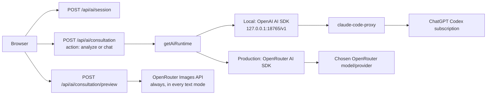

# Home Decor AI Provider Analysis

**Date:** 14 August 2026  
**Scope:** Read-only review of `/home/shubham/Projects/home-decor`. No application files or secret values were changed or read.

## Decision

Use `claude-code-proxy` only for local development. Use OpenRouter through its dedicated AI SDK provider in production.

The current project already follows this pattern for text AI. It needs stronger capability checks and live parity tests.

Do not deploy `claude-code-proxy` on Vercel. It is a local third-party proxy. It uses a signed-in ChatGPT subscription session. OpenAI says ChatGPT subscriptions and Platform API billing are separate services. Treat the proxy as a developer tool, not a supported customer inference service. [OpenAI billing separation](https://help.openai.com/en/articles/8156019-is-api-usage-included-in-chatgpt-subscriptions-even-if-i-have-a-paid-chatgpt-account), [proxy Codex guide](https://claude-code-proxy.raine.dev/providers/codex/)

## Current implementation

The locked package versions are:

| Package | Locked version | Use |
|---|---:|---|
| `ai` | `6.0.237` | Server streaming, structured output, UI stream protocol |
| `@ai-sdk/openai` | `3.0.89` | Local OpenAI-compatible Responses client |
| `@ai-sdk/react` | `3.0.239` | `useChat` client hook |
| `@openrouter/ai-sdk-provider` | `2.9.1` | Production OpenRouter provider |
| `zod` | `4.4.3` | Request and model-output validation |

The project has one server-only runtime selector in `src/lib/ai/model.ts`.

| `AI_PROVIDER` value | Selected runtime | Default model |
|---|---|---|
| `local-proxy` | AI SDK OpenAI provider pointed at `http://127.0.0.1:18765/v1` | `CCP_MODEL` or `gpt-5.6-terra` |
| `openrouter` | Dedicated OpenRouter AI SDK provider | `OPENROUTER_MODEL` or `openai/gpt-5.6-terra` |
| `mock` | Local deterministic response | None |

If `AI_PROVIDER` is unset, the code selects `local-proxy` outside production. It selects `openrouter` in production.

The local runtime calls `createOpenAI(...).responses(modelId)`. Its API key is a placeholder. The proxy replaces it with its stored ChatGPT/Codex login.

The production runtime calls `createOpenRouter(...).chat(modelId)`. It requires `OPENROUTER_API_KEY`. It sets `compatibility: "strict"`, an app title, and `APP_ORIGIN` when set.

The local runtime sends these OpenAI provider options:

- `store: false`
- `parallelToolCalls: false`
- `reasoningContext: "all_turns"`

No application-defined LLM tools exist today. The catalog ranking runs in local TypeScript code. The model produces room analysis and chat text only.

## Actual request paths



### Room analysis

`ConsultationWorkspace` sends `action: "analyze"`, the intake, and a room image data URL. The image is limited to JPEG, PNG, or WebP and about 8.5 MB.

`analyzeRoom()` calls `streamText()` with `Output.object({ schema: roomAnalysisSchema })`. It sends the image, a controlled analysis prompt, and an abort signal.

The server waits for `result.output`. It then ranks recommended catalog products locally. The model does not choose product IDs directly.

AI SDK supports `streamText()` and `Output.object()` for structured generation. The stream error path should use `onError`, as this project does. [AI SDK structured output guide](https://ai-sdk.dev/docs/ai-sdk-core/generating-structured-data), [AI SDK `streamText` reference](https://ai-sdk.dev/docs/reference/ai-sdk-core/stream-text)

### Chat

`ConsultationResults` uses `useChat()` and `DefaultChatTransport`. It posts to the same route with `action: "chat"`.

The server validates UI messages, builds a system prompt, and streams `streamText()` back through `toUIMessageStreamResponse()`.

The system prompt includes the intake, room analysis, and verified catalog records. The request accepts at most 40 UI messages.

The client sends the CSRF header with every request. The server creates a signed, HTTP-only session cookie. It also applies process-local rate limits.

The AI SDK transport model matches this design. `useChat()` can use a custom `DefaultChatTransport`, and the server can return a UI message stream. [AI SDK transport guide](https://ai-sdk.dev/docs/ai-sdk-ui/transport)

### Image preview is separate

Image preview does not use the selected text runtime.

`src/lib/ai/image-runtime.ts` always posts directly to `https://openrouter.ai/api/v1/images`. It always needs `OPENROUTER_API_KEY`.

This means local development still needs an OpenRouter key to show image previews. Otherwise, preview returns a safe configuration error. The text model can still use the local Codex subscription.

This is the most important gap in the proposed local-only subscription plan.

## Local development setup

`pnpm dev` runs `scripts/dev.sh`.

For `local-proxy`, the script starts Next.js and this command together:

```text
CCP_CODEX_RESPONSES_API=1 claude-code-proxy serve --no-monitor --port 18765
```

`CCP_CODEX_RESPONSES_API=1` is required. It enables the proxy's `/v1/responses` and `/v1/chat/completions` routes. The app correctly selects the Responses route. [Proxy HTTP API](https://claude-code-proxy.raine.dev/reference/http-api/), [proxy configuration](https://claude-code-proxy.raine.dev/reference/configuration/)

The installed executable reports version `0.1.32`. The user must sign in first with:

```text
claude-code-proxy codex auth login
```

The proxy uses its own stored ChatGPT login. It does not read Codex CLI credentials. Available models depend on the subscribed account. Use `claude-code-proxy models` after login. [Proxy Codex authentication and models](https://claude-code-proxy.raine.dev/providers/codex/)

The supplied `.env.example` uses:

```dotenv
AI_PROVIDER=local-proxy
CCP_OPENAI_BASE_URL=http://127.0.0.1:18765/v1
CCP_MODEL=gpt-5.6-terra
AI_SESSION_SECRET=<long local secret>
```

It also shows a separate OpenRouter image key and image model.

### Local setup risk: `.env.local`

Next.js loads `.env.local`, but `scripts/dev.sh` reads only `.env` when it decides whether to start the proxy.

If `AI_PROVIDER=openrouter` exists only in `.env.local`, Next.js can select OpenRouter while the script still starts the local proxy. Set `AI_PROVIDER` in the shell or `.env` until the script is changed to read the same environment files.

The non-local branch also starts Next.js twice when extra script arguments are supplied. This is not part of normal `pnpm dev` use, but it can confuse diagnostics.

## Local proxy capabilities and limits

For registered Codex models, the proxy's `/v1/responses` route preserves native Codex Responses JSON and SSE output. It supports native structured output and function calls through the Responses path.

Do not switch the local runtime to Chat Completions when adding tools. The proxy documents that Codex Chat Completions does not support function calls. [Proxy Responses and Chat Completions limits](https://claude-code-proxy.raine.dev/reference/http-api/)

The local proxy listens on loopback by default and accepts incoming requests without client authentication. Never expose it through a tunnel, LAN address, router forwarding, or Vercel. [Proxy security warning](https://claude-code-proxy.raine.dev/reference/http-api/)

Keep `CCP_TRAFFIC_LOG` disabled. Proxy traffic captures can contain prompts and tool content. The proxy is third-party software. Its own documentation says provider subscriptions, model access, terms, and enforcement remain upstream. [Proxy configuration](https://claude-code-proxy.raine.dev/reference/configuration/), [proxy project warning](https://github.com/raine/claude-code-proxy)

## Production OpenRouter setup

Use the dedicated `@openrouter/ai-sdk-provider`, as the project does. This is better than treating OpenRouter as a generic OpenAI base URL.

OpenRouter's AI SDK guide uses `createOpenRouter()` with `streamText()`. The current production model ID, `openai/gpt-5.6-terra`, exists in OpenRouter's catalog and advertises image input, tools, and structured output parameters. Model availability can still change, so validate it during deployment. [OpenRouter AI SDK guide](https://openrouter.ai/docs/guides/community/vercel-ai-sdk), [current Terra model page](https://openrouter.ai/openai/gpt-5.6-terra)

Set these production variables in Vercel. Keep every value server-only.

```dotenv
AI_PROVIDER=openrouter
OPENROUTER_API_KEY=<production key>
OPENROUTER_MODEL=openai/gpt-5.6-terra
OPENROUTER_IMAGE_MODEL=openai/gpt-image-2
AI_SESSION_SECRET=<long random secret>
APP_ORIGIN=https://your-production-domain.example
```

Set `AI_PROVIDER=openrouter` explicitly. Do not depend on the `NODE_ENV` fallback.

Create a dedicated production OpenRouter key. Give it an expiry and a spending limit. Do not use a personal development key. [OpenRouter API key limits](https://openrouter.ai/docs/api/api-reference/api-keys/create-keys)

Use account or key guardrails to limit models, providers, and budget. [OpenRouter guardrails](https://openrouter.ai/docs/guides/features/guardrails/overview)

## Why the two paths are not identical

AI SDK gives both paths the same `LanguageModel` interface. It does not make provider behavior identical.

| Concern | Local Codex proxy | Production OpenRouter |
|---|---|---|
| HTTP interface | OpenAI Responses | OpenRouter Chat Completions through its AI SDK provider |
| Account | Signed-in ChatGPT/Codex subscription | Metered OpenRouter API key |
| Model availability | Account-specific proxy catalog | OpenRouter model catalog and routing rules |
| Structured room output | Native Codex Responses schema output | Requires a selected model endpoint that supports the required output mode |
| Future function tools | Use Responses route | Choose a tool-capable model and endpoint |
| Image preview | Not used by current code | Always OpenRouter direct Images API |
| Deployment | Developer computer only | Vercel server route |

The installed OpenRouter provider declares a tool-oriented default object generation mode. This makes `Output.object()` capability important even though the application defines no tools today.

For production structured output, select a model that supports JSON schema. Enable strict schema handling. Set `provider.require_parameters: true` so OpenRouter does not route a schema request to an endpoint that cannot support it. [OpenRouter structured outputs](https://openrouter.ai/docs/guides/features/structured-outputs), [OpenRouter provider routing](https://openrouter.ai/docs/guides/routing/provider-selection)

If future work adds calendar, search, or ordering tools, keep the local adapter on the Responses API. Select OpenRouter models that support tools. OpenRouter standardizes tool calling, but each underlying endpoint has its own capability and reliability. [OpenRouter tool calling](https://openrouter.ai/docs/guides/features/tool-calling)

## Important risks and controls

| Priority | Risk | Current state | Required control |
|---|---|---|---|
| P0 | Local image preview still costs OpenRouter | It always uses OpenRouter | Accept this, disable preview locally, or add a separate local image adapter later |
| P0 | Proxy exposure spends subscription quota | Loopback defaults are safe | Keep `CCP_BIND_ADDRESS=127.0.0.1`; never expose the port |
| P0 | Production runs a local proxy by mistake | Vercel cannot reliably reach local loopback | Set `AI_PROVIDER=openrouter` in production and fail startup if it is not set |
| P1 | Provider feature mismatch | Responses locally; Chat Completions in production | Run the same analysis and chat test matrix against both paths |
| P1 | Schema or vision request routes to an unsupported endpoint | Current model selection is only a string | Add capability tests and `require_parameters: true` for production structured requests |
| P1 | Local model can produce long output | Output limits are omitted for local requests | Decide and test a local output cap before launch |
| P1 | Subscription token leakage | Proxy stores OAuth tokens | Keep proxy state private; do not mount or copy it into a deployment image |
| P1 | Provider routing changes output behavior | OpenRouter can route among providers | Pin a provider order or allowlist when output behavior must stay stable |
| P2 | Local rate limits differ from production | The app uses `maxRetries: 1` | Test 401, 402, 429, and 5xx paths with user-safe errors |
| P2 | Current rate limits are process-local | In-memory Maps reset and do not share across instances | Use a shared rate-limit store before public scale |
| P2 | Text failures lack diagnostic telemetry | Client gets a safe generic error | Log provider, model, status, latency, retry count, and token use. Never log room images or prompts. |

## Privacy and data controls

Room images, dimensions, notes, chat text, and catalog context leave the server in model requests.

OpenRouter routes to providers with different logging and retention policies. Set a privacy policy before launch. Use provider allowlists, `data_collection: "deny"`, and zero-data-retention routing where the product requires it. [OpenRouter provider logging](https://openrouter.ai/docs/guides/privacy/provider-logging/), [OpenRouter ZDR](https://openrouter.ai/docs/guides/features/zdr)

Do not enable OpenRouter input/output logging for production room images unless the retention policy has been approved. That feature can retain full prompts and completions for at least three months. [OpenRouter input/output logging](https://openrouter.ai/docs/guides/features/input-output-logging)

The current application keeps room and preview data in the browser for seven days. Document this behavior in the privacy policy before launch.

## Recommended provider boundary

The existing `getAiRuntime()` function is the correct location for a provider boundary. Keep route handlers and React components provider-agnostic.

Expand the runtime contract when implementation starts:

```ts
type AiCapability = "vision" | "structured-output" | "tools" | "streaming";

type AiRuntime = {
  label: "local-proxy" | "openrouter" | "mock";
  model: LanguageModel;
  modelId: string;
  capabilities: ReadonlySet<AiCapability>;
  providerOptions?: ProviderOptions;
};
```

Keep configuration separate by environment. Do not select a provider from a user request, prompt, or client value.

Use a single explicit configuration record for each workload:

| Workload | Required capability | Local selection | Production selection |
|---|---|---|---|
| Room analysis | Vision and structured output | Codex Responses model | OpenRouter vision and JSON-schema model |
| Consultation chat | Streaming text | Codex Responses model | OpenRouter chat model |
| Future tools | Function tools and serial execution | Codex Responses only | OpenRouter tool-capable model with allowed providers |
| Room preview | Image generation and edit references | Currently OpenRouter only | OpenRouter only |

Do not add a production fallback to the local proxy. If OpenRouter fails, return a safe retry message or use a separately approved production API provider.

## Migration and launch plan

1. Keep the current local proxy and OpenRouter split.
2. Make `AI_PROVIDER` explicit in each deployed environment.
3. Record model IDs by workload. Do not share one untested default across all workloads.
4. Add a startup health check that tests configuration, not model inference.
5. Add a protected diagnostic route only in local development. It can call `/healthz` and report a safe status.
6. Add a provider capability test for vision, structured output, streaming, and any future tools.
7. Add production cost caps, model allowlists, and privacy restrictions in OpenRouter.
8. Add server-side telemetry without content data.
9. Add a shared rate limiter before public traffic.
10. Keep `AI_PROVIDER=mock` for deterministic unit and browser tests.

## Required test matrix

Run these cases before release.

| Area | Cases |
|---|---|
| Local proxy | Healthy proxy, missing executable, missing login, expired login, unsupported model, proxy restart |
| Analysis | JPEG, PNG, WebP, invalid image, size limit, cancelled request, schema failure, malformed model output |
| Chat | First turn, multi-turn context, stop button, network loss, stream failure, 40-message limit |
| OpenRouter | Valid key, missing key, invalid key, 402 credit error, 429 limit, 5xx error, upstream timeout |
| Capability parity | Vision, strict structured output, stream completion, future function tool call |
| Image preview | No key, moderation error, 402, 429, timeout, second attempt, remote catalog image conversion |
| Security | No API key in browser bundle, CSRF failure, cross-origin request, abuse rate limit, proxy port inaccessible from LAN |
| Deployment | Vercel has OpenRouter variables, no proxy process, correct `APP_ORIGIN`, correct production model ID |

The current test suite covers mocked image-runtime behavior. It does not exercise a live local proxy or live OpenRouter text path. Add those contract tests before treating provider switching as production-ready.

## Source list

- [OpenAI: ChatGPT subscription and API billing are separate](https://help.openai.com/en/articles/8156019-is-api-usage-included-in-chatgpt-subscriptions-even-if-i-have-a-paid-chatgpt-account)
- [claude-code-proxy: Codex provider](https://claude-code-proxy.raine.dev/providers/codex/)
- [claude-code-proxy: HTTP API](https://claude-code-proxy.raine.dev/reference/http-api/)
- [claude-code-proxy: configuration](https://claude-code-proxy.raine.dev/reference/configuration/)
- [Vercel AI SDK: structured data](https://ai-sdk.dev/docs/ai-sdk-core/generating-structured-data)
- [Vercel AI SDK: streamText](https://ai-sdk.dev/docs/reference/ai-sdk-core/stream-text)
- [OpenRouter: Vercel AI SDK integration](https://openrouter.ai/docs/guides/community/vercel-ai-sdk)
- [OpenRouter: provider routing](https://openrouter.ai/docs/guides/routing/provider-selection)
- [OpenRouter: structured outputs](https://openrouter.ai/docs/guides/features/structured-outputs)
- [OpenRouter: tool calling](https://openrouter.ai/docs/guides/features/tool-calling)
- [OpenRouter: privacy and provider logging](https://openrouter.ai/docs/guides/privacy/provider-logging/)
- [OpenRouter: guardrails](https://openrouter.ai/docs/guides/features/guardrails/overview)
