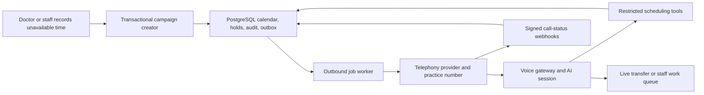

# Voice-agent appointment rescheduling: implementation design

**Prepared:** 9 August 2026  
**Scope:** A dentist becomes unavailable. The system must contact affected patients and reschedule safely.

> This is an engineering design. It is not legal advice. Confirm call, consent, recording, and health-data rules for each launch market.

## Recommendation

Build the scheduling and safety core. Buy PSTN calling.

Use PostgreSQL for appointments, holds, campaigns, and audit data. Use a job worker for outbound attempts. Use a telephony provider such as Twilio for numbers and calls. Keep the AI provider behind a small voice-gateway interface.

Start with a narrow agent. It may explain a schedule change, collect preferences, offer valid slots, confirm one choice, and transfer to staff. It must not give clinical advice. It must not explain the doctor's absence.

The current project is only a Next.js user-interface prototype. Its calendar reads demo data and keeps appointments in client state in [calendar-workspace.tsx](/home/shubham/Projects/dentist-management-system/src/components/workspace/calendar-workspace.tsx). It has no database, authentication, server API, worker, or telephony integration. Build those foundations before adding voice.

## Architecture



### Keep these boundaries

| Own in this product | Buy or isolate |
|---|---|
| Appointment rules, provider skills, rooms, buffers, calendar blocks, holds, booking transaction, patient preferences, escalation policy, staff work queue, audit log | Phone numbers, PSTN termination, caller ID, call progress, machine detection, speech runtime, model inference |
| Versioned internal APIs that the agent calls | A replaceable `TelephonyAdapter` and `VoiceRuntime` |

Twilio can create outbound calls, report call progress, and queue calls above the account calls-per-second limit. Its call events can arrive out of order. [Twilio Call resource](https://www.twilio.com/docs/voice/api/call-resource)

### Build versus buy

Buy the phone network, carrier compliance support, and call delivery. Build the calendar rules and final booking transaction.

You can also buy a managed voice-agent runtime for the pilot. Select one only if it supports outbound calls, server-side scheduling tools, live transfer, signed webhooks, data controls, and the required contractual terms. Keep it behind the voice-runtime adapter. Do not let it become the appointment system of record.

Choose a direct Twilio plus Realtime build when you need the most control. It costs more engineering time because you own the audio bridge, turn handling, model tools, and failure recovery.

### Two viable voice paths

1. **Fastest direct path:** Twilio calls the patient. `<Connect><Stream>` connects the audio to a long-lived voice gateway. The gateway connects to a Realtime model and executes the restricted tools.
2. **Lower audio-plumbing path:** Twilio connects the answered call to an AI provider over SIP. OpenAI Realtime accepts SIP calls and exposes accept, reject, transfer, and hang-up controls. Run a proof-of-call before selecting it. It can limit media control options. [OpenAI Realtime calls](https://developers.openai.com/api/reference/resources/realtime/subresources/calls)

Use the first path if staff transfer, recording controls, and provider portability matter. It needs a durable WebSocket service. Do not run that service inside a short-lived route handler.

Twilio bidirectional Media Streams use base64 encoded `audio/x-mulaw` at 8 kHz. Test codecs and interruption handling end to end. Do not assume transparent audio forwarding. [Twilio Media Streams messages](https://www.twilio.com/docs/voice/media-streams/websocket-messages)

OpenAI's current Realtime models support WebRTC, WebSocket, and SIP. `gpt-realtime-2.1-mini` supports tool use and lists lower audio-token prices. Test it against the stronger model with real scripted calls. [GPT-Realtime-2.1 mini](https://developers.openai.com/api/docs/models/gpt-realtime-2.1-mini) and [GPT-Realtime-2.1](https://developers.openai.com/api/docs/models/gpt-realtime-2.1)

## Data model and scheduling rule

Store all times as `timestamptz`. Store each practice and provider time zone. Convert to local time only for search and speech. Test daylight-saving changes.

Use these core tables:

- `providers`, `operatories`, `appointment_types`, and `provider_capabilities`;
- `appointments`, with a version number and an immutable history;
- `calendar_allocations`, for an appointment, absence block, hold, room, chair, assistant, or equipment;
- `unavailability_events`, `reschedule_campaigns`, and `reschedule_cases`;
- `slot_holds`, `call_attempts`, `telephony_events`, `agent_tool_events`, and `outbox_events`;
- append-only `audit_events`.

Use one allocation table for every capacity constraint. Do not use a pre-flight `SELECT` as the booking guarantee.

PostgreSQL range exclusion constraints can prevent overlap. Combine the provider or resource key with a `tstzrange`, then add a separate constraint for each constrained resource. PostgreSQL documents this exact non-overlap use case. [PostgreSQL range constraints](https://www.postgresql.org/docs/current/rangetypes.html)

Example design:

```sql
CREATE EXTENSION IF NOT EXISTS btree_gist;

ALTER TABLE calendar_allocations
  ADD CONSTRAINT active_provider_time_must_not_overlap
  EXCLUDE USING gist (
    provider_id WITH =,
    scheduled_range WITH &&
  )
  WHERE (occupies_provider);
```

Apply equivalent constraints for an operatory, chair, assistant, or equipment. Let a migration add these constraints. Most ORM schemas cannot express them fully.

### Create the campaign atomically

When staff confirms an absence:

1. Start a short database transaction.
2. Lock the provider and the affected appointment rows.
3. Insert the absence allocation.
4. Mark matching appointments `reschedule_pending`.
5. Release their active allocations in the same transaction.
6. Create one case per affected appointment.
7. Write matching outbox events and audit events.
8. Commit.

The old appointment remains in history. The system does not silently delete it.

Use a serializable transaction for a final booking. Retry only a serialization failure. PostgreSQL requires applications to retry transactions that fail this way. [PostgreSQL transaction isolation](https://www.postgresql.org/docs/current/transaction-iso.html)

## Candidate slots and final booking

The agent must never calculate availability itself. It asks scheduling tools.

Each candidate search must enforce:

- appointment duration and required before/after buffers;
- provider qualification and allowed substitute providers;
- working hours, leave, lunch, and policy blocks;
- room, chair, assistant, and equipment capacity;
- other patient appointments, when the practice blocks patient overlaps;
- local time zone, minimum notice, and appointment-type rules;
- the campaign's `not_before` date, normally the next local calendar day;
- patient availability preferences and staff approval rules.

Return two or three plain-language choices. Do not reserve every candidate. Create a short hold only after the patient selects one.

Use this tool contract. Give the model only the case token. Do not give it database identifiers.

| Tool | Safe behavior |
|---|---|
| `get_case_context(caseToken)` | Returns a minimum voice-safe context. It returns no clinical notes or absence reason. |
| `verify_contact(caseToken, proof)` | Applies the practice identity policy. The caller number alone is not proof. |
| `search_slots(caseToken, preferences, quoteVersion)` | Returns current choices and a new version. |
| `hold_slot(caseToken, slotId, quoteVersion)` | Creates a short, one-use hold. It rejects an inactive campaign. |
| `commit_reschedule(caseToken, holdId, spokenConfirmation)` | Runs one transaction. It verifies the hold, case, appointment version, and all constraints. |
| `create_handoff(caseToken, reason)` | Stops automation and creates a staff item. |
| `record_contact_preference(caseToken, preference)` | Stores an opt-out or a preferred time. It takes effect before another attempt. |

`commit_reschedule` must lock the case, appointment, and hold. It must check that the hold has not expired. It must insert active allocations, update the appointment, consume the hold, append an audit event, and write a confirmation outbox event in one commit.

If any check fails, return a neutral error. The agent must offer fresh choices or staff help. It must not claim that a booking succeeded.

### API surface

Use server-only route handlers or a separate API service. Validate every body with Zod. Keep the agent routes private.

```text
POST /api/unavailability-events
POST /api/reschedule-campaigns/{campaignId}/start
POST /api/internal/voice/cases/{caseToken}/verify
POST /api/internal/voice/cases/{caseToken}/slots/search
POST /api/internal/voice/cases/{caseToken}/holds
POST /api/internal/voice/cases/{caseToken}/commit
POST /api/internal/voice/cases/{caseToken}/handoff
POST /api/webhooks/twilio/voice
POST /api/webhooks/twilio/status
WS   /voice/media/{shortLivedToken}
```

Put a campaign ID, case ID, attempt ID, provider call ID, and AI session ID on every event. These identifiers make reconciliation possible.

## Call lifecycle

| State | Meaning | Next action |
|---|---|---|
| `queued` | The case is eligible. | Worker schedules one call attempt. |
| `dialing` | The provider request was accepted. | Wait for call events. |
| `connected` | The patient reached the voice flow. | Verify safely. |
| `negotiating` | The agent is collecting preferences. | Search and offer slots. |
| `held` | A candidate hold exists. | Read back date, time, provider, and location. |
| `booked` | The transaction committed. | Send confirmation. |
| `needs_staff` | The agent cannot complete safely. | Create a prioritized work item. |
| `no_contact` | Attempts ended without a valid conversation. | Use approved alternate channel or staff. |
| `stopped` | The patient opted out or campaign ended. | Never dial again. |

The call starts with the practice name, the AI disclosure required by policy, and a generic scheduling reason. It asks whether it reached the intended patient before it discusses dates. If verification fails, it gives a generic callback path and ends.

The agent should say the following facts before booking:

- the exact local date and time;
- the provider or substitute provider;
- the office location;
- that it will replace the affected appointment.

It must wait for a clear confirmation. It must then call `commit_reschedule`.

### Agent prompt guardrails

The system prompt should:

- define one purpose: reschedule one affected appointment;
- require disclosure and verification before any appointment detail;
- ban medical advice, diagnosis, billing discussion, and explanation of the absence;
- ban inventing availability, policies, or clinic facts;
- require tools for every slot, hold, booking, transfer, and opt-out;
- require a spoken confirmation before `commit_reschedule`;
- require handoff for confusion, distress, complaints, a minor or proxy issue, complex treatment, language failure, or an emergency symptom;
- read dates slowly and use the clinic's local time zone;
- end after a final summary.

Use a deterministic conversation state machine around the model. Do not let prompt text be the sole business control.

## Outbound work, retries, and concurrency

Use an outbox worker. A worker claims one due item with a lease. It creates one `call_attempt` before it sends the provider request.

Do not automatically redial after an ambiguous timeout from the telephony provider. Mark it `send_unknown`, reconcile with callbacks and provider records, then retry only if policy allows. This avoids duplicate calls.

Request `initiated`, `ringing`, `answered`, and `completed` status events. Twilio supports those events and includes a sequence number, but separate requests can arrive out of order. [Twilio call status events](https://www.twilio.com/docs/voice/api/call-resource)

Treat every incoming provider event as at-least-once. Store the provider event ID under a unique index. Make state updates monotonic. Twilio documents duplicate delivery and out-of-order events for Event Streams. [Twilio event delivery](https://www.twilio.com/docs/events/event-delivery-and-duplication)

Use a policy table, not hard-coded retries:

- allowed local call windows and weekday rules;
- maximum attempts and delay sequence;
- do-not-call, channel, and language preferences;
- maximum campaign deadline;
- same-day or high-priority staff escalation;
- voicemail wording and whether voicemail is allowed.

Cancel queued attempts immediately when staff resolves the case, the patient books online, the doctor becomes available, or an opt-out arrives. Before every tool call, check that the campaign remains active.

Answering-machine detection can help route a voicemail. It is imperfect. Async detection also shares Twilio's stream limit with Media Streams. Start without it, then add it after a measured pilot. [Twilio AMD guide](https://www.twilio.com/docs/voice/answering-machine-detection)

## Security, audit, and operations

Verify every Twilio webhook signature before parsing or acting on it. Use the Twilio Node SDK validator and the exact public URL. Twilio warns against home-built validators because webhook parameters can change. [Twilio webhook security](https://www.twilio.com/docs/usage/webhooks/webhooks-security)

Use HTTPS, secret management, least-privilege service accounts, encryption, role-based access, and a documented retention policy. Do not place full transcripts, recordings, or medical notes in ordinary application logs.

Record these audit facts:

- who created, approved, paused, or cancelled the absence campaign;
- the affected appointment version and original slot;
- every candidate query, hold, tool call, booking result, and staff override;
- call attempt, delivery status, transfer, opt-out, model/version, prompt version, and outcome;
- the final appointment version and confirmation event.

Default to no recording until the practice approves a jurisdiction-specific policy. Keep transcript retention separate from the clinical record. Store a concise operational outcome unless a reviewed policy requires more.

Measure:

- campaign completion before the unavailable time;
- answer, verification, booking, handoff, opt-out, and no-contact rates;
- slot-hold expiry and booking-conflict rates;
- double-booking constraint failures;
- time from absence to final resolution;
- call latency, tool latency, model errors, and cost per resolved case;
- webhook signature failures and stuck job count.

Alert staff when an unresolved case nears its deadline. Alert engineering on failed booking transactions, repeated webhook failures, and stuck media sessions.

## Libraries and deployment

Use these as the default TypeScript stack:

| Need | Suggested component |
|---|---|
| Application UI and protected HTTP routes | Next.js 16, already in this project |
| Persistent calendar data | Managed PostgreSQL and `pg` or an ORM |
| Schema validation | `zod` |
| Database migrations | ORM migrations plus custom SQL for range constraints |
| Job execution | A separate Node worker. Use a PostgreSQL outbox first. Add `pg-boss` or BullMQ only if it reduces operating risk. |
| Telephony | `twilio` Node SDK |
| Long-lived media bridge | A dedicated Node service using `ws` |
| AI connection | Official `openai` SDK where it supports the selected API, otherwise a small typed WebSocket client |
| Logging and traces | `pino` and OpenTelemetry |
| Time | Temporal APIs or `@js-temporal/polyfill`; never hand-roll time-zone arithmetic |

Host the web application, worker, and media service separately. The media service needs stable WebSocket connections and graceful shutdown. Place worker and database near the practice's required data region.

For a first cost test, use a lower-cost realtime model and log actual audio tokens, seconds, call attempts, and transfer time. As of this research, OpenAI lists `gpt-realtime-2.1-mini` at $10 per million input audio tokens and $20 per million output audio tokens. This is not a per-call price. Add PSTN, number, speech, storage, and platform fees to the measured total. [OpenAI model pricing](https://developers.openai.com/api/docs/models/gpt-realtime-2.1-mini)

## Delivery plan

### Phase 0 — foundation

Build authentication, PostgreSQL schema, audited calendar writes, provider availability, booking constraints, and manual rescheduling. Add a staff campaign preview before any call.

### Phase 1 — reliable campaign engine

Create absence campaigns, affected-case lists, candidate search, holds, final transaction, notification outbox, manual staff queue, and operational dashboards. Test concurrent online and staff bookings.

### Phase 2 — narrow automated calls

Integrate the practice phone number, signed webhooks, call attempts, a generic voicemail policy, and a voice agent that only collects preferences and creates staff handoffs. Run staff-monitored test calls first.

### Phase 3 — controlled agent booking

Enable holds and final booking after explicit confirmation. Limit to simple appointment types. Sample every call. Require a staffed fallback.

### Phase 4 — optimization

Add measured AMD, additional languages, online fallback links, automated call-time optimization, and provider substitutions. Expand only after the safety and conversion metrics hold.

## Verification plan

Test the schedule engine before the voice layer.

- Unit-test duration, buffers, skills, resources, time zones, and daylight-saving boundaries.
- Run database integration tests with simultaneous holds, online booking, staff booking, campaign pause, and final commit.
- Replay duplicate and out-of-order provider webhooks. Check deduplication and monotonic case states.
- Use stub tools with scripted transcripts. Assert allowed tool sequences, confirmation wording, disclosure, handoff, and opt-out behavior.
- Test poor audio, interruption, silent calls, voicemail, disconnects, transfer failure, and a model-provider outage.
- Run load tests for the largest expected absence campaign. Verify rate limits and staffing queues.
- Start with internal test numbers. Then run a supervised pilot with a narrow appointment type.

## Acceptance checklist

- [ ] The database rejects all provider and resource overlaps.
- [ ] The absence action creates every case and audit event atomically.
- [ ] A patient can never receive a promise before the booking transaction commits.
- [ ] A retry cannot create two calls or two bookings.
- [ ] Webhook validation, deduplication, and ordering tests pass.
- [ ] The agent has no tool that accepts raw appointment IDs or arbitrary times.
- [ ] The agent never says why the doctor is unavailable.
- [ ] The agent stops after opt-out and routes unsafe cases to staff.
- [ ] Staff can pause a campaign and stop future calls immediately.
- [ ] Staff can see the original slot, new slot, attempt history, and next owner.
- [ ] The system tests DST, buffers, rooms, providers, online-booking races, and a disconnected call.
- [ ] A pilot reviews recordings or transcripts only under the approved policy.
- [ ] The team measures completed reschedules, not merely completed calls.

## Sources

- [Twilio Call resource](https://www.twilio.com/docs/voice/api/call-resource)
- [Twilio Media Streams WebSocket messages](https://www.twilio.com/docs/voice/media-streams/websocket-messages)
- [Twilio Answering Machine Detection](https://www.twilio.com/docs/voice/answering-machine-detection)
- [Twilio webhook security](https://www.twilio.com/docs/usage/webhooks/webhooks-security)
- [Twilio event delivery and duplication](https://www.twilio.com/docs/events/event-delivery-and-duplication)
- [OpenAI Realtime calls API](https://developers.openai.com/api/reference/resources/realtime/subresources/calls)
- [OpenAI GPT-Realtime-2.1 mini](https://developers.openai.com/api/docs/models/gpt-realtime-2.1-mini)
- [PostgreSQL range types](https://www.postgresql.org/docs/current/rangetypes.html)
- [PostgreSQL transaction isolation](https://www.postgresql.org/docs/current/transaction-iso.html)
