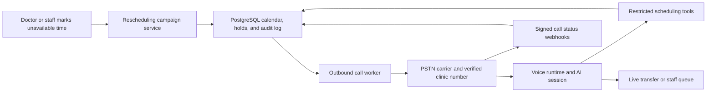

# Voice agent for dentist appointment rescheduling

**Research date:** 9 August 2026  
**Scope:** A dentist is unavailable. The system must contact affected patients and safely move appointments.

> This report is technical research. It is not legal advice. Obtain advice before calling patients in each market.

## Short answer

Yes. This system can make real telephone calls and reschedule appointments.

The AI model does not place telephone calls by itself. You need a phone carrier or CPaaS provider.

You also need a clinic-owned scheduling service. The AI must not directly write appointments to a database.

Build the scheduling, safety, and audit core. Buy PSTN calling and voice infrastructure.

Start with a narrow agent. It should only explain a schedule change, collect availability, offer valid slots, confirm one slot, or transfer to staff.

Do not let the agent give medical advice. Do not let it state why the dentist is unavailable.

## Recommended approach

Use a phased design.

1. Build the calendar and campaign engine first.
2. Add a carrier that can call the patient population.
3. Add an agent with restricted scheduling tools.
4. Begin with staff-monitored calls.
5. Enable automatic booking only for simple appointments.

For a U.S. clinic, the control-first option is **Twilio Programmable Voice + ConversationRelay + a clinic-owned backend**. Twilio supplies PSTN calling, speech handling, and webhooks. Your service owns the appointment rules and final transaction. [Twilio ConversationRelay](https://www.twilio.com/docs/voice/conversationrelay)

For an India-first clinic, use an Indian carrier such as **Exotel** or another approved local SIP provider. Confirm caller-ID approval, Voice DLT requirements, route quality, and prices before purchase. Exotel documents a bidirectional outbound AI-call API for Indian routes. [Exotel Connect Voice AI API](https://exotel.com/build/one-api-call-your-ai-bot-is-on-the-phone/)

For the fastest proof of concept, use a managed voice runtime such as Retell, Vapi, Bland, or ElevenLabs. Keep it behind a small adapter. Do not make it the appointment system of record.

## System architecture

Keep these ownership boundaries.

| Clinic product owns | Provider supplies |
|---|---|
| Appointment rules, rooms, chairs, buffers, holds, final booking, patient preferences, staff queue, audits | Phone numbers, PSTN termination, caller ID, call progress, speech transport, model inference |
| A versioned scheduling API | A replaceable telephony adapter and voice-runtime adapter |

The current project is a Next.js user-interface prototype. It has no database, worker, telephony service, or server API. Build those foundations before calls.

## The exact patient workflow

1. Staff records the dentist unavailability.
2. The system locks affected appointments in a short database transaction.
3. It creates one rescheduling case for each appointment.
4. It checks consent, call preference, time zone, and opt-out status.
5. A worker places one outbound call through the carrier.
6. The agent identifies the practice and says it is automated.
7. The agent verifies the correct person before any appointment detail.
8. The agent asks for preferred days or times.
9. It asks the scheduling service for two or three current choices.
10. It places a short hold after the patient selects one.
11. It reads back the exact date, time, provider, and location.
12. It waits for clear confirmation.
13. The scheduling service commits the new appointment atomically.
14. The system sends a confirmation and closes the case.

If any step is uncertain, transfer to staff. Never guess a slot. Never promise a booking before the transaction commits.

### Safe first words

Use generic words until verification succeeds.

> "Hello. This is an automated scheduling assistant from Bright Dental. May I speak with Alex?"

After verification, say only that the practice needs to move the visit. Do not disclose the dentist's reason.

For voicemail, leave only the practice name and a callback number. HHS advises providers to limit voicemail disclosure. [HHS voicemail guidance](https://www.hhs.gov/hipaa/for-professionals/faq/198/may-health-care-providers-leave-messages/index.html)

## Scheduling design that prevents double booking

The schedule service is the critical component. It must remain deterministic.

Store all timestamps as `timestamptz`. Store each practice's time zone. Convert to local time only for speech and search.

Use data for providers, chairs, rooms, equipment, appointment types, availability blocks, appointments, short holds, calls, and audit events.

Check every capacity rule:

- appointment duration and clinical buffers;
- dentist skill and permitted substitute dentist;
- chair, room, assistant, and equipment capacity;
- working hours, leave, lunch, and policy blocks;
- patient-overlap policy;
- local time zone and daylight-saving changes;
- earliest allowed replacement date;
- patient preference and staff approval requirements.

Use database constraints as the final protection. PostgreSQL range exclusion constraints can prevent overlapping resource allocation. [PostgreSQL range types and constraints](https://www.postgresql.org/docs/current/rangetypes.html)

Do not use a `SELECT` check as the booking guarantee.

The final booking action should lock the case and hold. It should add allocations, update the appointment, consume the hold, and add audit events in one transaction.

Use a transaction retry only for a documented serialization failure. [PostgreSQL transaction isolation](https://www.postgresql.org/docs/current/transaction-iso.html)

### Give the model only these tools

| Tool | Required safety rule |
|---|---|
| `get_case_context` | Return only voice-safe information. Never return clinical notes or the absence reason. |
| `verify_contact` | Apply the clinic identity policy before details. A caller number alone is not proof. |
| `search_slots` | Return current choices from the schedule service. |
| `hold_slot` | Make one short-lived hold after the patient selects a choice. |
| `commit_reschedule` | Commit only after a spoken confirmation. Validate every constraint again. |
| `create_handoff` | Stop automation and create a staff task. |
| `record_contact_preference` | Apply opt-out or preferred-call-time changes before another dial. |

Use a case token, not raw database IDs. The model must never submit arbitrary times or appointment IDs.

## Calling architectures

### Option A — controlled text pipeline

**Twilio Voice + ConversationRelay + your WebSocket service + an LLM**

Twilio creates the outbound call. ConversationRelay sends the caller's text to your WebSocket service. Your service asks the LLM for a response and streams text back. Twilio turns it into speech. [ConversationRelay messages](https://www.twilio.com/docs/voice/conversationrelay/websocket-messages)

This is the recommended first production path. It keeps transcripts, tool calls, and booking state explicit.

It fits scheduling because the work needs predictable steps and durable audit records. OpenAI also recommends a chained voice pipeline for approval-heavy workflows. [OpenAI voice-agent architectures](https://developers.openai.com/api/docs/guides/voice-agents)

### Option B — natural speech-to-speech agent

**Twilio Voice + bidirectional Media Streams + a long-lived media gateway + OpenAI Realtime**

Twilio sends live audio to your gateway. The gateway sends it to the Realtime API and returns generated audio to Twilio.

This offers more natural turn taking. It requires more engineering. Your gateway must handle audio codecs, interruptions, reconnection, and long-lived WebSockets.

Twilio bidirectional streams use `audio/x-mulaw` at 8 kHz. They support real-time AI conversations. [Twilio Media Streams](https://www.twilio.com/docs/voice/media-streams)

OpenAI Realtime supports WebSocket, WebRTC, and SIP connections. It also supports tools, session events, and call transfer through SIP. [OpenAI Realtime overview](https://developers.openai.com/api/docs/guides/realtime) and [SIP guide](https://developers.openai.com/api/docs/guides/realtime-sip)

### Option C — managed voice-agent platform

Use Retell, Vapi, Bland, or ElevenLabs for a rapid pilot. These products provide agent orchestration, calls, transfer features, and webhooks.

They do not remove the need for a safe scheduling service. Most have separate carrier, model, data-retention, or compliance charges.

| Platform | Good use | Published price signal | Important check |
|---|---|---|---|
| Retell | Fast API-driven outbound pilot | $0.07–$0.31 per minute | Confirm country routes, BAA, and total cost. [Pricing](https://www.retellai.com/pricing) |
| Vapi | Custom provider choice | $0.05 per minute platform fee, plus providers | Its HIPAA add-on lists $2,000 per month. [Pricing](https://vapi.ai/pricing) |
| Bland | Managed outbound agent | $0.11–$0.14 per minute, carrier separate | Confirm country route and transfer terms. [Pricing](https://www.bland.ai/pricing) |
| ElevenLabs | Strong voices and built-in agent tools | $0.08 per extra minute, LLM and telephony at cost | HIPAA BAA support is enterprise-only. [Agent pricing](https://elevenlabs.io/pricing/agents) |

## Carrier choices

### United States or broad international coverage

Twilio is a clear control-first option. It can create outbound calls, send status callbacks, detect answering machines, and run outbound call flows. [Twilio outbound calling](https://www.twilio.com/docs/voice/tutorials/how-to-make-outbound-phone-calls)

Use a business number or verified caller ID. Enable only needed destination countries. Use a real callback path.

### India

Use a local carrier or approved SIP route. Do not assume a U.S. phone provider works correctly for Indian caller ID or commercial-calling rules.

Exotel exposes campaigns, virtual numbers, call controls, and an India-region API. Its carrier documentation describes local PSTN connectivity for AI and contact-center systems. [Exotel virtual SIP trunking](https://support.exotel.com/support/solutions/articles/3000133452-flow-and-api-configuration-guide-for-voice-ai-contact-centre-platforms-via-exotel-virtual-sip-trunk)

Plivo publishes India outbound calling at ₹0.60 per minute and a local number at ₹250 per month. Check billing increments and commercial-calling approval before buying. [Plivo India Voice pricing](https://www.plivo.com/voice/pricing/in/)

## Libraries and infrastructure

Use TypeScript because the current project already uses Next.js and TypeScript.

| Need | Suggested library or service |
|---|---|
| UI and protected routes | Next.js, already installed |
| Database | PostgreSQL with `pg`, Prisma, or Drizzle |
| Validation | `zod` |
| Database constraints | ORM migration plus custom PostgreSQL SQL |
| Background jobs | PostgreSQL outbox first; add `pg-boss` or BullMQ when needed |
| Twilio call control | `twilio` |
| Long-lived media or agent gateway | A separate Node service using `ws` |
| AI | Official `openai` SDK, or a vendor SDK behind an adapter |
| Observability | `pino`, OpenTelemetry, Sentry |
| Time zones | Temporal APIs or `@js-temporal/polyfill` |

Run the media gateway as a durable container service. Do not put long-lived voice WebSockets in a short-lived serverless route.

Use separate web, worker, and media services. Store secrets in a managed secret store. Use least-privilege credentials.

Verify each provider webhook signature. Process webhooks as at-least-once and out of order. Twilio advises signature validation for voice webhooks. [Twilio webhook security](https://www.twilio.com/docs/usage/security)

## Cost model

Prices change. Treat these as a planning baseline, not a quote.

### U.S. list-price example

Twilio lists U.S. local outbound calling at $0.0140 per minute. It lists ConversationRelay at $0.0700 per minute. It lists Answering Machine Detection at $0.0075 per call. [Twilio U.S. Voice pricing](https://www.twilio.com/en-us/voice/pricing/us)

That gives a known base of **$0.084 per connected minute**, before LLM, recording, taxes, and number rental.

For 1,000 connected calls of three minutes each:

- carrier plus ConversationRelay: about **$252**;
- one AMD result per call: about **$7.50**;
- text-model cost: usually small, but measure it;
- number rental, recordings, retries, ringing, and compliance plan: extra.

### U.S. Realtime-mini estimate

Twilio Media Streams list at $0.0044 per minute. OpenAI lists `gpt-realtime-2.1-mini` audio at $10 per million input tokens and $20 per million output tokens. [Twilio pricing](https://www.twilio.com/en-us/voice/pricing/us) and [OpenAI pricing](https://developers.openai.com/api/docs/pricing)

OpenAI documents about 600 input audio tokens per minute and 1,200 output audio tokens per minute. [Realtime cost guide](https://developers.openai.com/api/docs/guides/realtime-costs)

Assume a three-minute call, with half the time spent by each speaker. The estimated model audio cost is about $0.045 per call. Combined with Twilio Voice and Media Streams, the simple base is about **$108 per 1,000 three-minute connected calls**. This excludes retries, text tokens, recording, tax, and infrastructure.

This path costs less at list price. It costs more to build and operate.

### India example

Twilio lists India mobile outbound at $0.0496 per minute and ConversationRelay at $0.0700 per minute. This is about **$0.1196 per connected minute** before LLM and add-ons. Confirm actual routes and registration with the carrier. [Twilio India Voice pricing](https://www.twilio.com/en-us/voice/pricing/in)

For India, local carrier pricing and approval can matter more than the AI price. Get a written quote for the actual number type and destination mix.

### Hidden costs

- unsuccessful and repeat call attempts;
- phone number rental and branded calling;
- answering-machine detection;
- recordings, transcript storage, and redaction;
- carrier registration and compliance tiers;
- staff transfer minutes;
- healthcare BAAs and security plans;
- database, worker, monitoring, and incident support.

Do a 50-call proof before selecting a vendor. Measure answer rate, completed reschedules, minutes, transfer rate, and cost per completed case.

## Legal, privacy, and consent risks

### United States

The FCC ruled that AI-generated voices are an artificial voice under TCPA rules. Calls need prior express consent unless an exception applies. [FCC Declaratory Ruling](https://docs.fcc.gov/public/attachments/FCC-24-17A1_Rcd.pdf)

Healthcare exceptions have exact limits. The current rule covers identity disclosure, callback information, opt-out, purposes, and frequency. It also has different rules for residential and wireless calls. [47 CFR 64.1200](https://www.ecfr.gov/current/title-47/chapter-I/subchapter-B/part-64/subpart-L/section-64.1200)

Do not assume a multi-minute conversational rescheduling call fits a reminder exception. Collect and preserve explicit consent. Ask healthcare telecommunications counsel to review the exact script and market.

The system should offer immediate opt-out in the call. It should update the clinic do-not-call list before another attempt.

HIPAA allows appointment reminders without patient authorization. It still requires reasonable safeguards. Limit voicemail and wrong-person disclosure. [HHS appointment reminder guidance](https://www.hhs.gov/hipaa/for-professionals/faq/286/are-appointment-reminders-allowed-under-hipaa-without-authorization/index.html)

If PHI enters a vendor system, sign a BAA with that vendor. Twilio requires a BAA and a HIPAA-eligible configuration. Its HIPAA Accounts need Security or Enterprise Edition. [Twilio HIPAA](https://www.twilio.com/en-us/hipaa) and [HIPAA Accounts](https://www.twilio.com/docs/iam/twilio-editions/hippa)

OpenAI requires an API BAA and Modified Retention for PHI. Realtime is listed as HIPAA eligible under that configuration. [OpenAI HIPAA eligibility](https://help.openai.com/en/articles/20001069-hipaa-eligible-products-and-functionality)

State recording laws can be stricter. Get jurisdiction-specific advice before recording. Default to no recording until the policy is approved.

### India

TRAI treats robot calls and health-related commercial communication as regulated categories. Consent and customer preferences matter. [TRAI UCC explanation](https://trai.gov.in/what-spam-or-ucc) and [TCCCPR framework](https://www.trai.gov.in/tcccpr)

Use the approved carrier process. Do not call DND-blocked numbers without a reviewed lawful basis. Keep auditable consent, caller identity, call timing, and opt-out data.

India's DPDP Rules provide for clear notice, consent management, withdrawal, and security controls. Some obligations have delayed commencement. Build data minimization and withdrawal controls now. [MeitY DPDP Rules](https://www.meity.gov.in/documents/act-and-policies/digital-personal-data-protection-rules-2025-gDOxUjMtQWa) and [commencement notification](https://www.meity.gov.in/static/uploads/2025/11/c56ceae6c383460ca69577428d36828b.pdf)

## Failure modes to plan for

| Failure | Safe system response |
|---|---|
| Wrong person answers | Give only a generic callback path. Do not disclose appointment details. |
| Voicemail or answering machine | Use a generic callback message, or end the call. |
| Patient wants a human | Transfer or add a high-priority staff task. |
| Patient has urgent symptoms | Stop scheduling. Give the approved emergency escalation message. |
| Poor audio or language mismatch | Ask once for clarification. Then transfer or offer another approved channel. |
| Candidate slot becomes unavailable | Say it is no longer available. Fetch fresh choices. |
| Two callers select the same slot | Let the transaction choose one. Give the other caller fresh options. |
| Carrier timeout | Mark it unknown. Reconcile callbacks before retrying. |
| Duplicate or late webhook | Deduplicate by provider event ID. Apply only valid state changes. |
| Doctor becomes available again | Cancel queued cases and notify staff before more calls. |
| Patient books online | Cancel all queued call attempts immediately. |
| Model failure or tool error | Stop automation and route to staff. |

## Build plan

### Phase 0 — foundation

Build authentication, PostgreSQL, calendar constraints, manual rescheduling, audit logging, and a staff campaign preview.

### Phase 1 — campaign engine

Build doctor absence, affected-case creation, candidate slots, short holds, final transaction, notification outbox, and staff queue.

### Phase 2 — supervised calls

Connect a test phone number. Verify signed webhooks. Start with an agent that only collects preferences and transfers to staff.

### Phase 3 — controlled booking

Allow simple appointment types to book after spoken confirmation. Sample every call and retain only approved data.

### Phase 4 — scale

Add more languages, improved call timing, online fallback links, AMD, substitute dentists, and scale controls after measured success.

## Pre-launch checklist

- [ ] The practice chose its launch country and legal review scope.
- [ ] The carrier approved the caller ID and destination routes.
- [ ] Contact consent, opt-out, and confidential-contact preferences are stored.
- [ ] Every provider processing PHI has the necessary contractual terms.
- [ ] The doctor absence reason never reaches the agent prompt or voicemail.
- [ ] The database rejects every provider and resource overlap.
- [ ] Every final booking is one transaction with a short hold.
- [ ] The model can call only restricted scheduling tools.
- [ ] The agent reads back the exact local date, time, location, and provider.
- [ ] The agent waits for a clear confirmation before booking.
- [ ] Webhook signatures, retries, duplicates, and disorder are tested.
- [ ] The system handles voicemail, wrong persons, silence, interruptions, and transfer failure.
- [ ] The system stops immediately after opt-out.
- [ ] A staffed fallback owns every unresolved case near the deadline.
- [ ] The team tested 50 calls and measured cost per completed reschedule.

## Companion research

- [Implementation design](voice-agent-appointment-rescheduling-implementation.md)
- [Telephony platform comparison](voice-agent-telephony-platforms.md)

